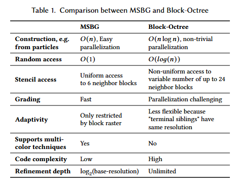

<p align="left">
  
</p>

# MSBG — Multiresolution Sparse Block Grids 

Implementation of the **Multiresolution Sparse Block Grid (MSBG)** data-structure as introduced in the SIGGRAPH 2025 paper "Adaptive Phase-Field-FLIP for Very Large Scale Two-Phase Fluid
Simulation" by Bernhard Braun, Jan Bender and Nils Thuerey.

---

## Key Features

* Extremely efficient treeless spatially adaptive data structure supporting both sparseness and multiresolution adaptivity.  
* No GPU needed. Designed for maximum efficiency on the CPU in order to leverage maximum RAM ressources for very large scale scenarios.   
* On a single CPU (32 cores, 256 GB RAM), MSBG is able to process sparse 3D Volumes at an effective resolution of 32768^3 containing 100 billion active (out of 30 trillion virtual) voxels at 16 bit precisison.
* Highly efficient PDE solver for sparse volumes that can advance the solution at a speed of ~10 billion unknowns per second per iteration. 
* Command-line demo program demonstrating sparse surface reconstruction from particles and sparse PDE smoothing (mean curvature flow). 

<p align="left">
  
</p>

## Prerequisites

MSBG has only a few dependencies: Just C++11 and TBB <https://github.com/uxlfoundation/oneTBB>. The header-only VectorClass library <https://github.com/vectorclass/version1> is
already included for convenience. The MSBG library compiles on Linux as well as on Windows via MSYS2/MinGW64.

## Limitations

At this stage, the MSBG library is still in an experimental phase (research code). Some features may be insufficiently tested and lack comprehensive documentation. It is recommended to refer to msbg_demo.cpp for usage examples of the library.

---

## Building from Source

```bash
git clone https://github.com/your-org/MSBG.git
cd MSBG

mkdir build && cd build

# simple Make-based build provided for convenience
../mk               # builds the library and 'msbg_demo' executable
msbg_demo -h        # Show options


