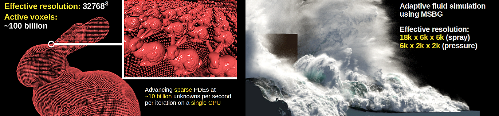

<p align="left">
  
</p>

# MSBG — Multiresolution Sparse Block Grids 

Implementation of the **Multiresolution Sparse Block Grid (MSBG)** data-structure as introduced in the SIGGRAPH 2025 paper "Adaptive Phase-Field-FLIP for Very Large Scale Two-Phase Fluid
Simulation" by Bernhard Braun, Jan Bender and Nils Thuerey.

---

## Key Features

* Extremely efficient data structure supporting both sparseness and multiresolution adaptivity.  
* No GPU needed. Designed for maximum efficiency on the CPU in order to leverage maximum RAM ressources for very large scale scenarios.   
* On a single CPU (32 cores, 256 GB RAM), MSBG is able to process sparse 3D Volumes at an effective resolution of 32768^3 containing 100 billion active (out of 30 trillion virtual) voxels at 16 bit precisison.
* Highly efficient PDE solver for sparse volumes that can advance the solution at a speed of ~10 billion unknowns per second per iteration. 
* Command-line demo program demonstrating sparse surface reconstructing from particles and sparse PDE smoothing. 

## Prerequisites

MSBG has only few dependencies: Just C++11 and TBB <https://github.com/uxlfoundation/oneTBB>. The vectorclass header-only library <https://github.com/vectorclass/version1> is
already included for convenience. 

## Limitations

At this stage, the MSBG library is still in an experimental phase. Some features may be insufficiently tested and lack comprehensive documentation.

---

## Building from Source

```bash
git clone https://github.com/your-org/MSBG.git
cd MSBG

mkdir build && cd build

# simple Make-based build provided for convenience
../mk               # builds the library and 'msbg_demo' executable

